# PowerCo Customer Churn Analysis: Energy Price Sensitivity, Predictive Modelling & Revenue Impact

PowerCo, a major gas and electricity utility, is facing increasing customer churn in the SME (Small & Medium Enterprise) segment. The central hypothesis is that churn is primarily driven by customers' sensitivity to energy prices. This project tests that hypothesis end-to-end — from exploratory analysis of pricing and consumption behavior, through feature engineering and predictive modelling, to a business impact analysis of a proposed 20% discount intervention — using data provided as part of the BCG Data Science Virtual Experience Program.

---

## Datasets

Two raw datasets form the basis of the project:

**client_data.csv** — 14,606 SME client records with the following key fields:

| Column | Description |
|---|---|
| `id` | Unique client identifier |
| `channel_sales` | Sales channel through which the client was acquired |
| `cons_12m` | Energy consumption over the last 12 months (kWh) |
| `cons_gas_12m` | Gas consumption over the last 12 months (kWh) |
| `cons_last_month` | Energy consumption in the last month (kWh) |
| `date_activ` | Contract activation date |
| `date_end` | Contract end date |
| `date_modif_prod` | Date of last product modification |
| `date_renewal` | Date of last renewal |
| `forecast_cons_12m` | Forecasted energy consumption (12 months) |
| `forecast_discount_energy` | Forecasted energy discount |
| `forecast_price_energy_off_peak` | Forecasted off-peak energy price |
| `forecast_price_energy_peak` | Forecasted peak energy price |
| `forecast_price_pow_off_peak` | Forecasted off-peak power price |
| `has_gas` | Boolean flag — whether the client also purchases gas |
| `margin_gross_pow_ele` | Gross power margin on electricity |
| `margin_net_pow_ele` | Net power margin on electricity |
| `net_margin` | Overall net margin |
| `nb_prod_act` | Number of active products |
| `num_years_antig` | Number of years as a client (seniority) |
| `origin_up` | Origin of the contract/offer |
| `pow_max` | Maximum subscribed power |
| `churn` | Target variable — 1 if churned, 0 if retained |

**price_data.csv** — Monthly pricing records per client with variable and fixed prices across three time periods:

| Column | Description |
|---|---|
| `id` | Client identifier (joins to client_data) |
| `price_date` | Month of the pricing observation |
| `price_off_peak_var` | Variable price during off-peak hours |
| `price_peak_var` | Variable price during peak hours |
| `price_mid_peak_var` | Variable price during mid-peak hours |
| `price_off_peak_fix` | Fixed price during off-peak hours |
| `price_peak_fix` | Fixed price during peak hours |
| `price_mid_peak_fix` | Fixed price during mid-peak hours |

---

## Approach

### 1. Exploratory Data Analysis

**Churn distribution** — 9.7% of clients have churned against 90.3% retained, creating a significant class imbalance that needed to be addressed before modelling.

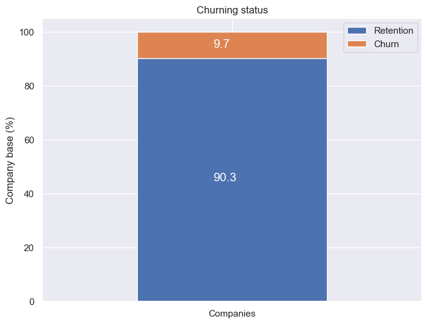

**Sales channel analysis** — Churn rates vary meaningfully across sales channels. The highest-churn channel sits at 12.1%, while the `MISSING` channel — introduced to represent null values — carries a 7.6% churn rate, suggesting the absence of channel data is itself a predictive signal worth retaining.

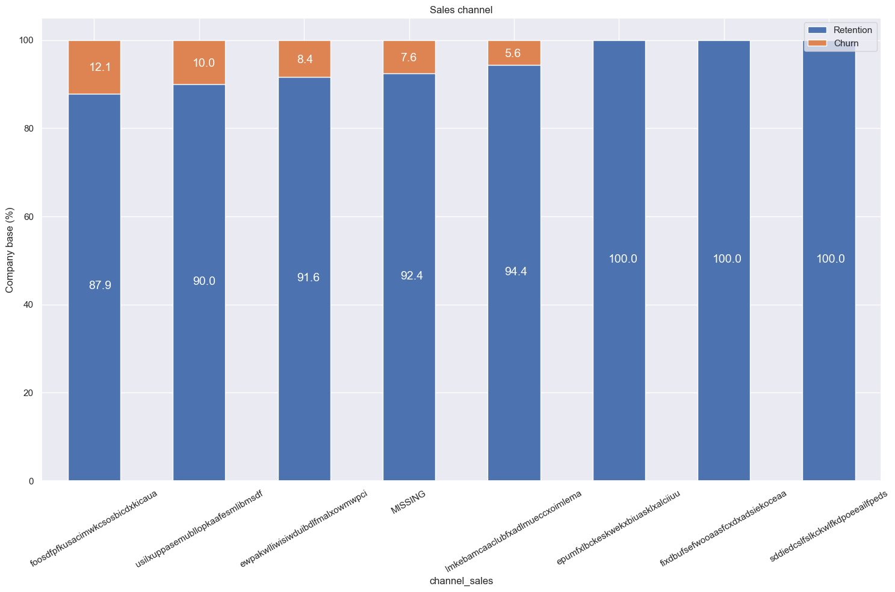

**Consumption distributions** — All four consumption columns (`cons_12m`, `cons_gas_12m`, `cons_last_month`, `imp_cons`) are heavily right-skewed with very long upper tails. The mass of records clusters near zero with extreme outliers extending to millions of kWh, confirming the need for log transformation before modelling.

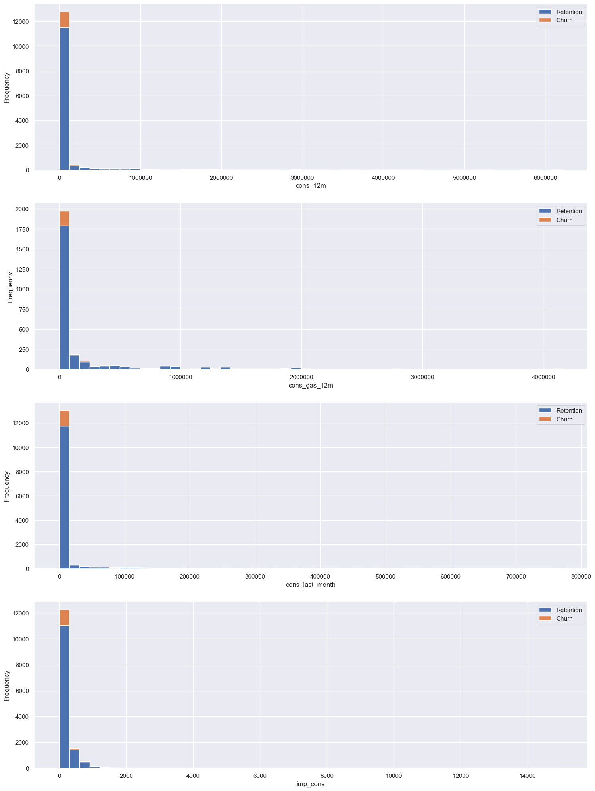

Boxplots grouped by churn class confirm the skewness extends across both retained and churned segments, with churned clients showing a tighter interquartile range and fewer extreme outliers.

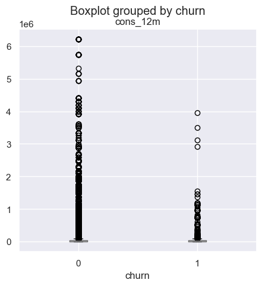

**Forecast variables** — All seven forecast columns show similar positive skewness. Boxplots reveal outliers at extreme values across all forecast fields, consistent with the raw consumption data.

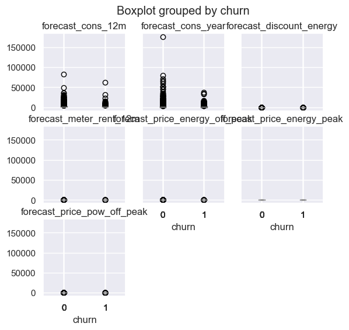

The distribution histograms show that `forecast_price_energy_off_peak` has a distinctive multimodal pattern, clustering at three price levels — an important structural characteristic of the pricing data.

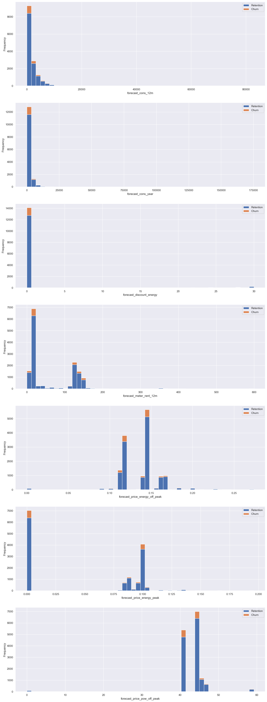

**Contract type (has_gas)** — Clients who also purchase gas from PowerCo churn at 8.2% vs. 10.1% for electricity-only clients — a ~2% difference that makes multi-product engagement a mild but consistent retention factor.

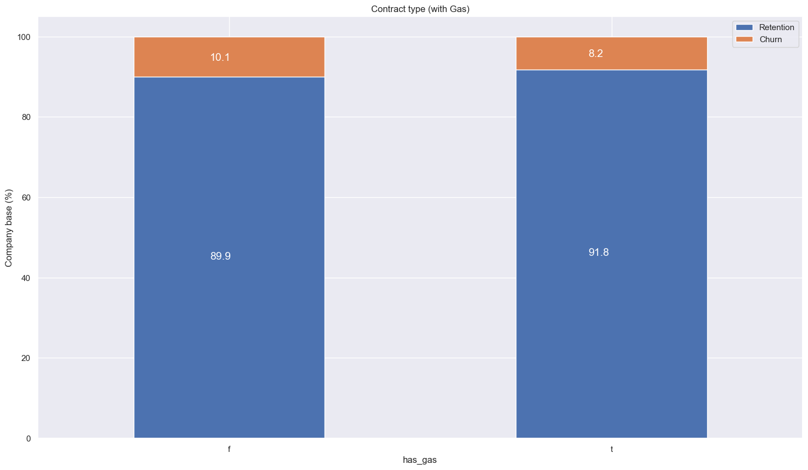

**Margins** — Boxplots of `margin_gross_pow_ele`, `margin_net_pow_ele`, and `net_margin` reveal significant upper-end outliers. The IQR is narrow for all three, with most clients clustered at low margin values and a long extreme tail upward.

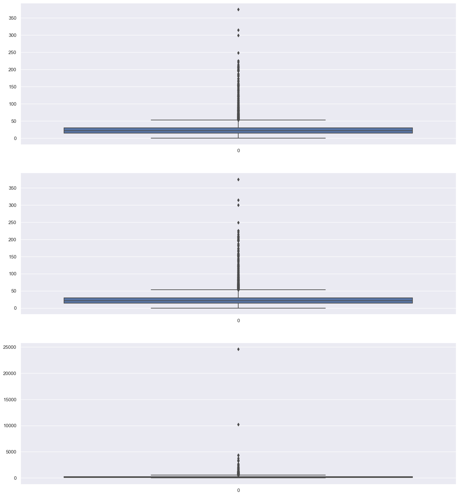

**Subscribed power** — `pow_max` is heavily right-skewed, with the vast majority of clients subscribing to under 25 kW. A small number of industrial clients extend to 300 kW. Churn proportions appear consistent across power brackets.

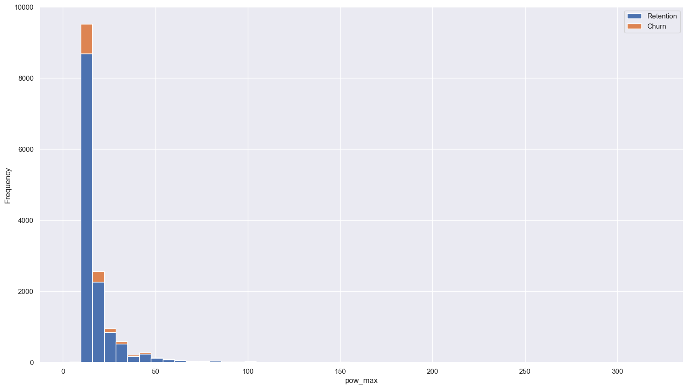

**Number of active products** — Churn rate is essentially flat across product counts 1–5 (~9.7–10%), dropping slightly for clients with 2 products (8.5%). Clients with 6+ products show 0% churn, though these are very small samples.

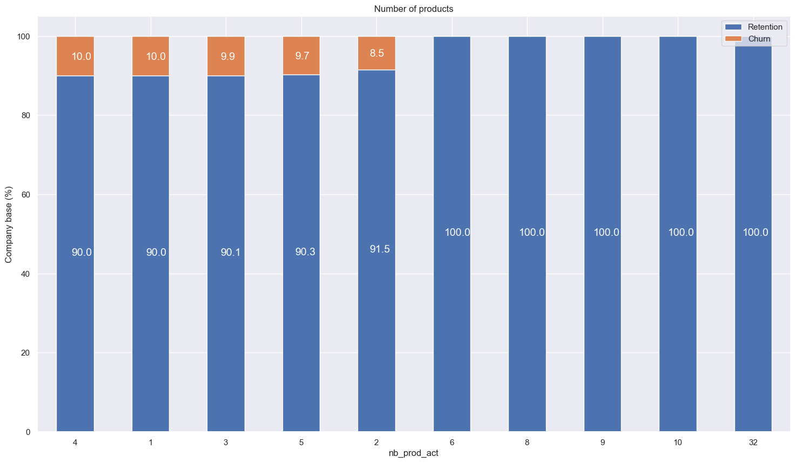

**Pricing distributions** — `price_off_peak_var` has a distinctive multimodal distribution across several discrete price clusters, with a wide spread from 0.0 to 0.25. The boxplot confirms a tight IQR around 0.13–0.15 with upper outliers extending to 0.27.

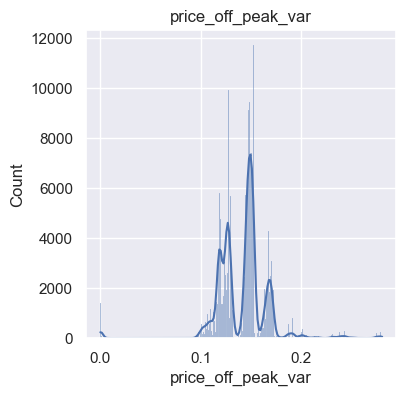

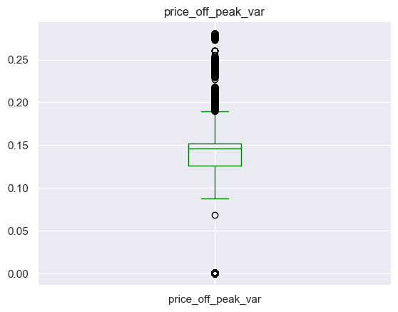

**Correlation across price features** — A correlation heatmap across all monthly price features reveals strong within-year clustering — December and January prices are highly correlated within the same year, which motivates the Dec–Jan delta feature engineered in the next phase.

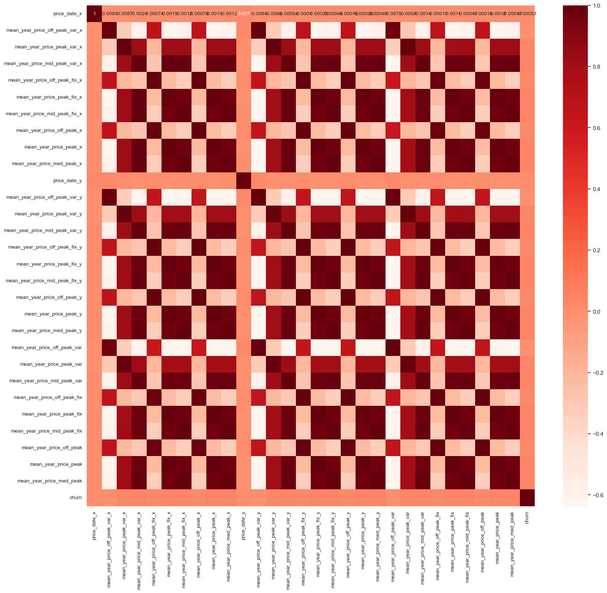

---

### 2. Feature Engineering

All feature engineering was performed on the cleaned dataset merged with `price_data.csv`.

**December–January off-peak price difference** — Based on a team hypothesis, the difference in off-peak variable and fixed prices between December and January was computed per client, capturing year-over-year price movement. Two features: `offpeak_diff_dec_january_energy` and `offpeak_diff_dec_january_power`.

**Mean price differences across time periods** — Average prices per time period were computed per client and six pairwise difference features were engineered across off-peak, peak, and mid-peak combinations for both variable and fixed pricing.

**Maximum monthly price differences** — The same six pairwise differences were computed at the monthly level and the maximum across all months was retained per client — capturing the worst single-month price spike experienced.

**Tenure** — Computed from contract activation and end dates. Analysis confirmed a meaningful ~4% step-down in churn at the 5-month mark, making early-stage engagement a high-leverage retention action.

**Date-derived features** — All four date columns transformed into months elapsed from 1 January 2016: `months_activ`, `months_to_end`, `months_modif_prod`, `months_renewal`.

**Log10 transformation** — Ten highly skewed numerical columns transformed using `np.log10(x + 1)`. Post-transformation distributions confirm stabilization — the three consumption variables now show near-normal distributions centered around 3–4, fully removing the extreme upper-tail distortion seen in EDA.

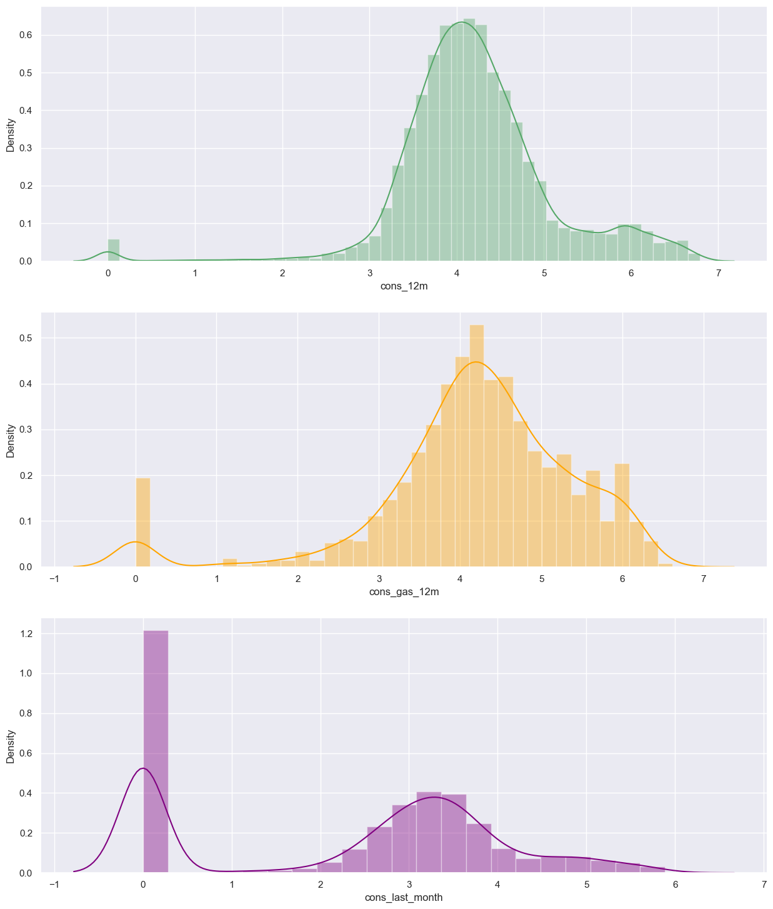

**Correlation pruning** — A full correlation heatmap across all 72 engineered features was generated. Two variables (`num_years_antig` and `forecast_cons_year`) were dropped due to high inter-feature correlation. The heatmap also confirms the distinct block structure of the three price feature families.

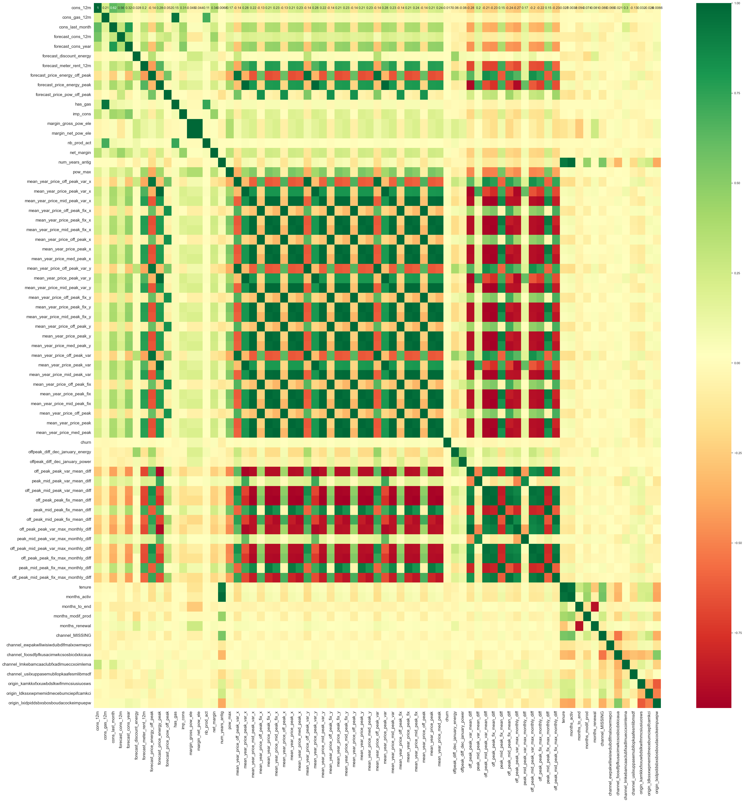

---

### 3. Class Imbalance Handling

The 90:10 target imbalance was addressed by applying SMOTE (Synthetic Minority Oversampling Technique) to the training set only, resampling the minority class until both classes reached 13,186 samples. The test set (4,382 records) was kept unmodified.

---

### 4. Predictive Modelling

**Logistic Regression** (C = 100, solver = liblinear) — Despite 90.9% overall accuracy, the confusion matrix tells the real story: the model correctly identified only 3 out of 393 actual churners. It essentially learned to predict "no churn" for almost all clients.

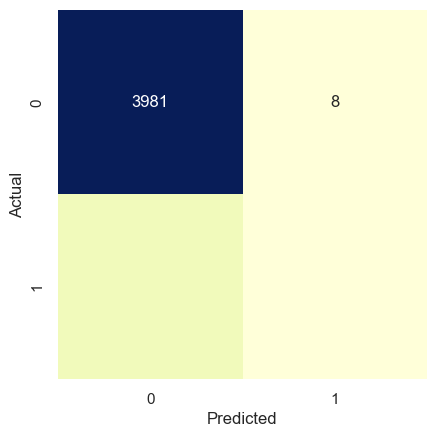

The ROC curve confirms weak discriminative power, with an AUC of 0.63 — barely above random. Logistic regression is fundamentally unsuitable for this imbalanced non-linear problem.

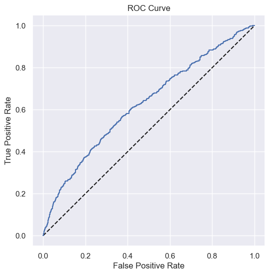

**Random Forest** (1,000 estimators) — The ROC curve shows a substantial improvement over logistic regression, with the curve bowing meaningfully toward the top-left corner, indicating much stronger discrimination between churn and retention.

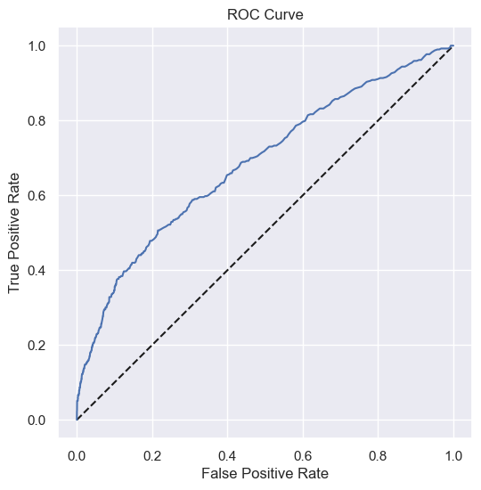

**Feature Importance** — The Random Forest reveals a clear hierarchy: `cons_12m`, `forecast_meter_rent_12m`, `net_margin`, `margin_net_pow_ele`, and `forecast_cons_12m` are the top five drivers — all consumption and margin variables. Time-based features (`months_activ`, `months_modif_prod`) rank in the top 10. The Dec–Jan off-peak price difference feature (`offpeak_diff_dec_january_energy`) appears in the top half, while most price sensitivity features cluster in the lower half — directly challenging the original hypothesis.

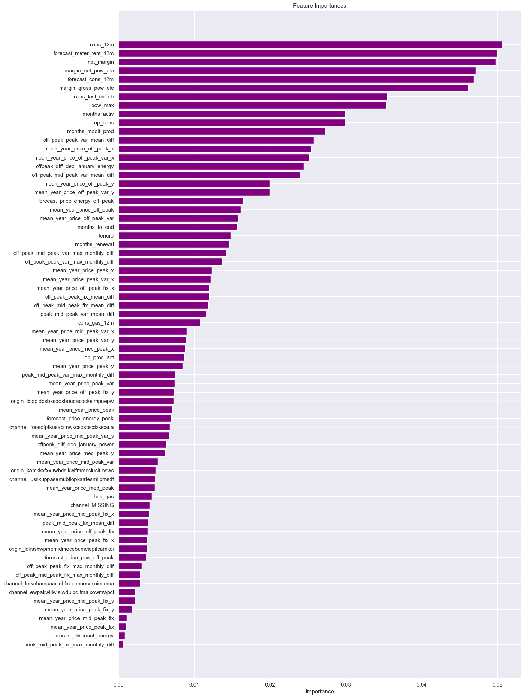

**Key conclusion on the hypothesis:** Price sensitivity is a weak-to-moderate contributor to churn, not the primary driver. Net margin, consumption volume, and relationship tenure are stronger signals.

---

### 5. Business Impact Analysis: Discount Strategy

A 20% discount was evaluated by sweeping probability cutoff values from 0.00 to 1.00 in 0.01 steps and computing revenue delta (intervention minus baseline) at each threshold.

**All high-risk clients** — The revenue delta curve peaks at a cutoff of **0.50**, yielding a maximum benefit of **$2,296.55**. Below this cutoff, the cost of discounting non-churners who don't need it rapidly erodes and then eliminates the revenue benefit.

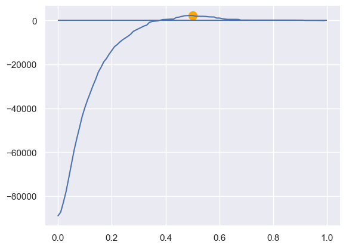

**High-value targeting only (revenue > £500)** — When restricting discounts to clients above the churn threshold AND with baseline revenue above £500, the revenue delta curve shifts — the optimal cutoff drops to **0.22** with a maximum benefit of **$6,614.33**, nearly 3x the blanket strategy. However, blanket high-risk targeting ultimately produces similar total revenue because the discount cost doesn't scale with customer count in this formulation.

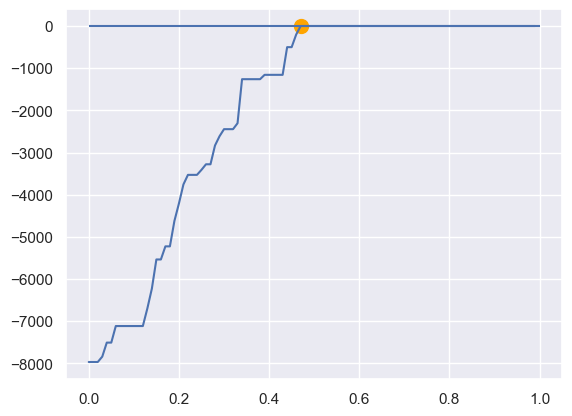

**Model calibration** — The reliability curve shows the Random Forest is bimodally calibrated: for most clients predicted probability is near 0 (model is confident they won't churn), and for a small number it is near 1. The histogram confirms the probability distribution is heavily concentrated at the low end, with very few predictions in the 0.2–0.5 range. This step-function shape means the 0.50 cutoff is effectively separating two discrete groups rather than a smooth probability gradient.

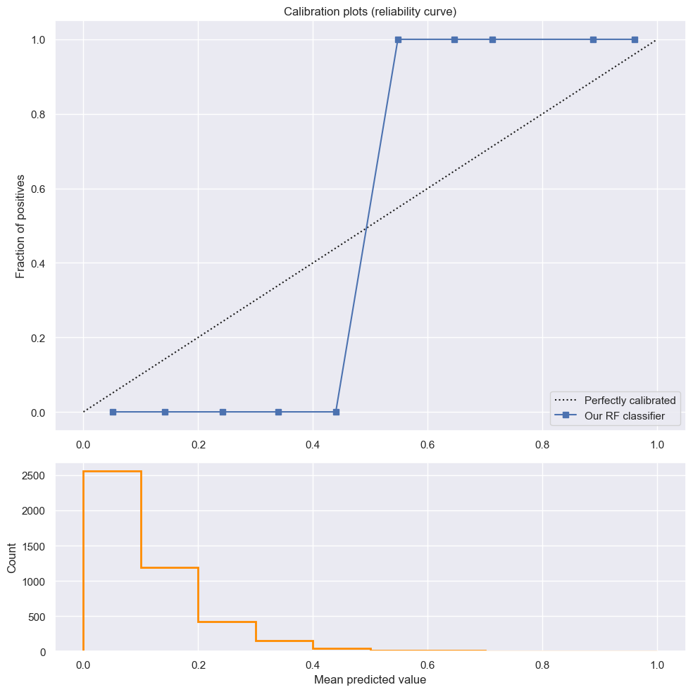

---

## Key Findings

- **Price sensitivity is not the dominant churn driver** — price-related features rank in the lower-to-middle tier of feature importances. Net margin, energy consumption, and contract tenure are consistently stronger signals, directly challenging the project's starting hypothesis.
- **The 4-month tenure threshold is a critical retention milestone** — clients who reach 5 months show a ~4% step-down in churn probability, making early-stage onboarding and engagement a high-leverage intervention.
- **Optimal discount cutoff is 0.50, not intuitive default values** — the revenue delta analysis shows that at any cutoff below 0.5, the cost of discounting retained clients outweighs the revenue saved from preventing churn. Blanket or low-threshold discounting destroys value.
- **Logistic regression is fundamentally unsuitable for this problem** — even after SMOTE resampling, it identified only 3 of 393 churners. Random Forest is substantially more appropriate.
- **Multi-product clients churn ~2% less** — gas + electricity clients show lower churn rates, making cross-selling an additional retention lever alongside the discount strategy.

---

## Tech Stack

| Tool | Purpose |
|---|---|
| Python (`pandas`, `numpy`) | Data loading, feature engineering, date transformations |
| `matplotlib`, `seaborn` | EDA — histograms, boxplots, stacked bars, correlation heatmaps |
| `scikit-learn` | Logistic Regression, Random Forest, ROC-AUC, calibration curves |
| `imbalanced-learn` (SMOTE) | Synthetic minority oversampling |
| `joblib` | Model serialization to `.pkl` |

---

## Repository Structure

```
├── Exploratory_Data_Analysis.ipynb               # EDA — distributions, churn patterns, price analysis
├── Feature_Engineering_and_Data_Modelling.ipynb  # Feature engineering, modelling, business impact
├── client_data.csv                               # Raw client records (14,606 rows)
├── price_data.csv                                # Monthly pricing data per client
├── churn_data_modeling.csv                       # Cleaned dataset used as modelling input
├── data_with_predictions.csv                     # Test set with predicted labels and churn probabilities
└── powerco_churn_model.pkl                       # Serialized Random Forest model
```

---

## Conclusion

- This project followed a complete data science workflow — from hypothesis testing through EDA, to feature engineering, model training, and translating model outputs into a business decision framework. The EDA phase was essential in revealing that churn is not a simple price-driven phenomenon but reflects a combination of consumption patterns, margin levels, contract age, and engagement timing.

- The feature engineering phase was the most technically intensive component, producing three families of price-change features (annual Dec–Jan deltas, mean inter-period differences, and maximum monthly spikes), four date-derived features, and log-transformed consumption variables — all grounded in explicit behavioral reasoning. The full correlation heatmap across 72 features confirmed the structural block separation between the three feature families and identified the two variables warranting removal.

- The business impact analysis bridges the gap between model output and executive action. By mapping churn probability cutoffs to revenue delta, the project provides a direct quantitative answer to the intervention question: not just "who will churn?" but "at what probability threshold does it become financially worthwhile to intervene?" — with the clear finding that the optimal threshold of 0.50 must be empirically derived rather than assumed.
